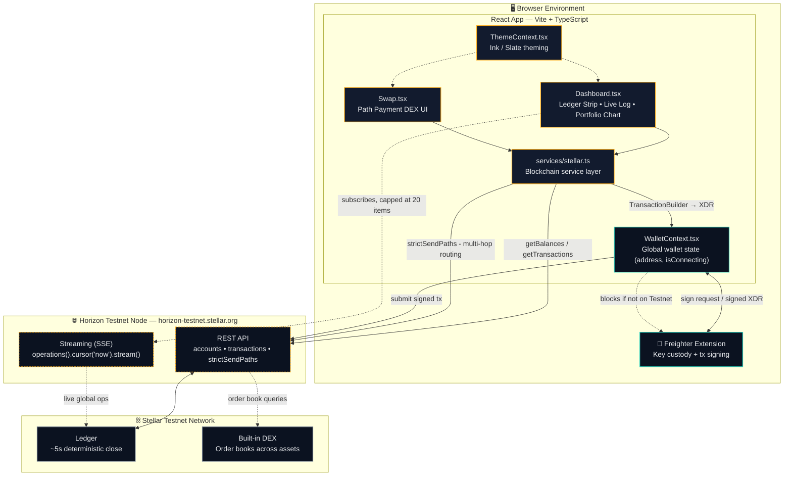
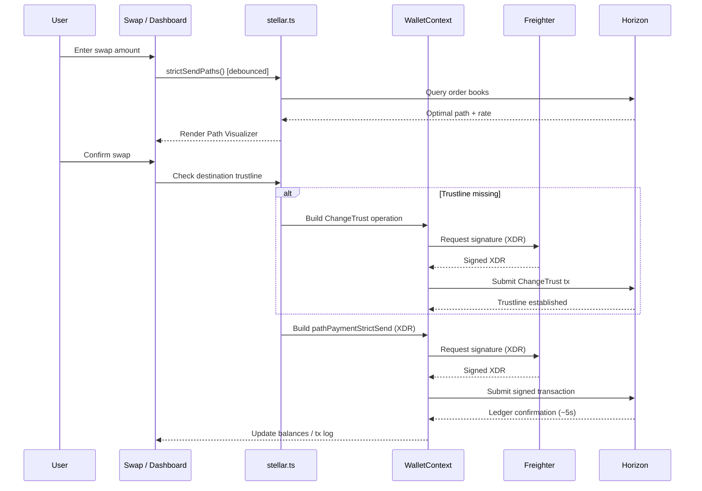

# StellarHub

**A developer control panel for the Stellar Testnet.**
Trustlines, ledger state, and path payments — surfaced with the precision of a terminal, not the gloss of a consumer wallet.

`React 18` · `TypeScript` · `Vite` · `Tailwind CSS` · `@stellar/stellar-sdk` · `@stellar/freighter-api`

---

## Table of Contents

- [Overview & Philosophy](#overview--philosophy)
- [Tech Stack](#tech-stack)
- [System Architecture](#system-architecture)
- [Core Services](#core-services)
- [Features](#features)
- [Transaction Lifecycle](#transaction-lifecycle)
- [UI / Design System](#ui--design-system)
- [Project Structure](#project-structure)
- [Getting Started](#getting-started)
- [Network Configuration](#network-configuration)
- [Contributing](#contributing)
- [License](#license)

---

## Overview & Philosophy

StellarHub is a decentralized application (dApp) built on the **Stellar Testnet**. Unlike consumer-facing crypto wallets — which lean on heavy gradients, animation, and simplified UX to hide complexity — StellarHub is built as a **developer control panel**. It targets builders who care about precision: ledger state, trustlines, and network mechanics, not a friendly abstraction over them.

The aesthetic reflects that intent: sharp corners, tabular monospace figures for every number, high-contrast states, and a deep ink/amber token system. It's designed to feel like a terminal — or a Bloomberg terminal for the Stellar network — rather than a fintech app.

## Tech Stack

| Layer | Choice | Purpose |
|---|---|---|
| Framework | React 18 (TypeScript) via Vite | App shell, fast HMR dev loop |
| Styling | Tailwind CSS + custom CSS variable tokens (`index.css`) | Design system enforcement |
| Icons | `lucide-react` | Iconography |
| Charts | `recharts` | Portfolio performance chart |
| Blockchain SDK | `@stellar/stellar-sdk` | Querying Horizon, building transactions, XDR |
| Wallet | `@stellar/freighter-api` | Browser extension wallet integration & signing |

## System Architecture



A standalone copy of this diagram lives in [`system-architecture.mermaid`](./system-architecture.mermaid).

**Reading the diagram:** UI components never talk to Horizon or Freighter directly — everything routes through `stellar.ts` (queries, path-finding, transaction building) and `WalletContext.tsx` (signing, submission, network-safety checks). This keeps blockchain logic out of components and testable in isolation.

## Core Services

### Wallet Management — `WalletContext.tsx`

A React Context providing global wallet state (`address`, `isConnecting`) to the whole app.

- Communicates with the **Freighter** browser extension via `@stellar/freighter-api`.
- Includes an explicit network guard: interactions are blocked unless the connected wallet is confirmed to be on **Testnet** — protecting against accidental Mainnet or custom-network usage.

### Stellar Service Layer — `src/services/stellar.ts`

The heart of the blockchain integration. Initializes a connection to the public Testnet Horizon node (`https://horizon-testnet.stellar.org`) and abstracts the SDK:

- **`getBalances()` / `getTransactions()`** — query the Horizon REST API for account data.
- **`addTrustline()`** — builds a `ChangeTrust` operation. Required on Stellar because an account cannot receive a custom asset (e.g. testnet USDC) without first explicitly trusting it.
- **Transaction signing** — every write operation follows the same path: build with `TransactionBuilder` → serialize to XDR → hand XDR to Freighter for signing → submit the signed transaction to Horizon.

## Features

### Dashboard (`Dashboard.tsx`)

| Component | What it does |
|---|---|
| **Live Network Log** | Real-time stream via SSE (`server.operations().cursor('now').stream()`) of global Testnet operations. Capped at 20 items in state to avoid memory growth / UI jank under load; the connection is closed cleanly on unmount. |
| **Ledger Strip & Pulse** | A pulsing element simulating Stellar's ~5-second ledger close cadence, alongside a horizontal strip of balances and transaction counts rendered in `tabular-nums` for perfect alignment. |
| **Portfolio Performance Chart** | `recharts` area chart of 7-day balance history. Deliberately uses `type="step"` rather than a smooth curve — reflecting the discrete, block-by-block nature of ledger state changes rather than implying continuous movement. |

### Swap / DEX Interface (`Swap.tsx`)

An interface onto Stellar's built-in decentralized exchange.

- **Path Payment Strict Send** — trades execute via `pathPaymentStrictSend`, not a naive swap. A debounced `useEffect` calls `server.strictSendPaths(...)` through `getOptimalPath` to query live Testnet order books and find the best multi-hop route (e.g. `XLM → AQUA → USDC`) for maximum output.
- **Path Visualizer** — once the optimal path resolves, the UI renders the exact asset sequence the protocol will use, along with the true effective exchange rate (factoring in order-book slippage and routing).
- **Implicit Trustline Handling** — if a user swaps into an asset they don't yet trust, `handleSwap` transparently asks Freighter to sign a `ChangeTrust` operation first, then executes the swap — no separate manual step.

### Level 2 — Token Leaderboard (`TokenLeaderboard.tsx`)

A real-time token holder ranking system powered by a Soroban smart contract.

- **Multi-wallet Watchlist** — store, label, and track multiple Stellar addresses (saved securely in localStorage).
- **Live Contract Events** — listens to Soroban event streams for balance changes and updates the leaderboard in real-time.
- **Frontend Contract Calls** — interact with a deployed Soroban contract directly from the React frontend.
- **Transaction Lifecycle Tracking** — detailed states (READY, SIGNING, SUBMITTED, CONFIRMING, SUCCESS, FAILED) for all on-chain actions.
- **Typed Error Handling** — robust error catching converting RPC and wallet errors into clean UI messages with expandable technical details.

#### Leaderboard Demo Data
Live Demo: [Localhost only right now]
Token Contract: CDLZFC3SYJYDZT7K67VZ75HPJVIEUVNIXF47ZG2FB2RMQQVU2HHGCYSC (Testnet Native XLM)
Leaderboard Contract: CAB7UAM35DVIJTD2ZWAMAHKMXWKC2MRO2PPOLDRLMDSGOBT4PO34TTRY
Contract Call Transaction: 046de9186cb6f7cd78a788a904444a217a6ac2401d8e91a665b74b7d8430fabb

## Transaction Lifecycle



## UI / Design System

The project overrides Tailwind defaults with a custom CSS variable layer (`index.css`).

**Typography**

| Role | Typeface | Used for |
|---|---|---|
| UI chrome | Inter | Labels, buttons, navigation |
| Data | JetBrains Mono | Balances, hashes, timestamps, operation counts |

**Color tokens**

| Token | Value | Role |
|---|---|---|
| Ink (dark bg) | `#0B1220` | Default background |
| Panel | `#121B2E` | Cards, strips, elevated surfaces |
| Slate 50 (light bg) | `#F8FAFC` | Light mode background |
| Signal amber | `#FFB020` | Primary accent, active states |
| Teal | `#2DD4BF` | Secondary / success data |
| Text primary | `#E8EAED` | Body text on dark surfaces |
| Text muted | `#7C8797` | Secondary/meta text |

**Structural rules**

- **Radii:** explicitly overridden to `0px` throughout — a deliberate sharp, rigid feel, not a default.
- **Focus states:** strict `2px solid` outlines, not soft glowing box-shadows — accessibility without softening the aesthetic.
- **Theming:** `ThemeContext.tsx` fully supports Dark ("Ink") and Light ("Slate 50") modes via Context + CSS variables applied at the document root.

## Project Structure

```
stellarhub/
├─ src/
│  ├─ context/
│  │  ├─ WalletContext.tsx      # wallet state, Freighter integration, network guard
│  │  └─ ThemeContext.tsx       # dark/light theming
│  ├─ services/
│  │  └─ stellar.ts             # Horizon queries, trustlines, tx building
│  ├─ pages/
│  │  ├─ Dashboard.tsx          # ledger strip, live log, portfolio chart
│  │  └─ Swap.tsx               # path payments, path visualizer
│  ├─ components/
│  │  ├─ LedgerStrip.tsx
│  │  ├─ LiveNetworkLog.tsx
│  │  ├─ PortfolioChart.tsx
│  │  └─ PathVisualizer.tsx
│  ├─ index.css                 # design tokens, radius/focus overrides
│  └─ main.tsx
├─ scripts/
│  └─ seedLiquidity.cjs         # Seeds DEX liquidity on testnet for local testing
├─ tailwind.config.js
├─ vite.config.ts
└─ package.json
```

*(Reflects the architecture described in this document; adjust to match the actual repo layout.)*

## Getting Started

**Prerequisites**

- Node.js 18+
- [Freighter](https://www.freighter.app/) browser extension, set to **Testnet**
- A funded Testnet account — use [Friendbot](https://friendbot.stellar.org) to fund a new keypair

**Installation**

```bash
git clone <repo-url>
cd stellarhub
npm install
```

**Environment variables** (`.env`)

```
VITE_HORIZON_URL=https://horizon-testnet.stellar.org
VITE_NETWORK_PASSPHRASE="Test SDF Network ; September 2015"
VITE_SOROBAN_RPC_URL=https://soroban-testnet.stellar.org
VITE_TOKEN_CONTRACT_ID=CDLZFC3SYJYDZT7K67VZ75HPJVIEUVNIXF47ZG2FB2RMQQVU2HHGCYSC
VITE_LEADERBOARD_CONTRACT_ID=CAB7UAM35DVIJTD2ZWAMAHKMXWKC2MRO2PPOLDRLMDSGOBT4PO34TTRY
```

**Contract Build Instructions**

To compile the Soroban smart contract:
```bash
cd contracts/token-leaderboard
cargo build --target wasm32-unknown-unknown --release
```

**Contract Deployment Instructions**

Use the Stellar CLI to deploy the contract to Testnet:
```bash
stellar contract deploy \
  --wasm target/wasm32-unknown-unknown/release/token_leaderboard.wasm \
  --source <your-testnet-account> \
  --network testnet
```
Copy the returned contract ID into your `.env` file as `VITE_LEADERBOARD_CONTRACT_ID`.

**Seeding Testnet Liquidity (Optional)**

If you want to test the Swap / DEX Interface with a custom token, you can run the liquidity seed script:
```bash
node scripts/seedLiquidity.cjs
```
This script creates an Issuer, Seller, and Buyer on the Testnet, establishes trustlines, mints a custom USDC asset, and places limit orders on the decentralized exchange (DEX) so you can execute path payments locally. Be sure to copy the output Issuer Public Key to test swaps against it!

**Run the dev server**

```bash
npm run dev
```

**Build for production**

```bash
npm run build
```

## Network Configuration

| Setting | Value |
|---|---|
| Horizon endpoint | `https://horizon-testnet.stellar.org` |
| Network passphrase | `Test SDF Network ; September 2015` |
| Wallet | Freighter (Testnet mode required) |
| Fund an account | [Friendbot](https://friendbot.stellar.org) |

## Contributing

Issues and PRs are welcome. Please keep new UI work aligned with the existing design tokens (`index.css`) rather than introducing ad-hoc colors or rounded corners — consistency is part of the product here.

## License

TBD — add a license file appropriate to your project (e.g. MIT).
